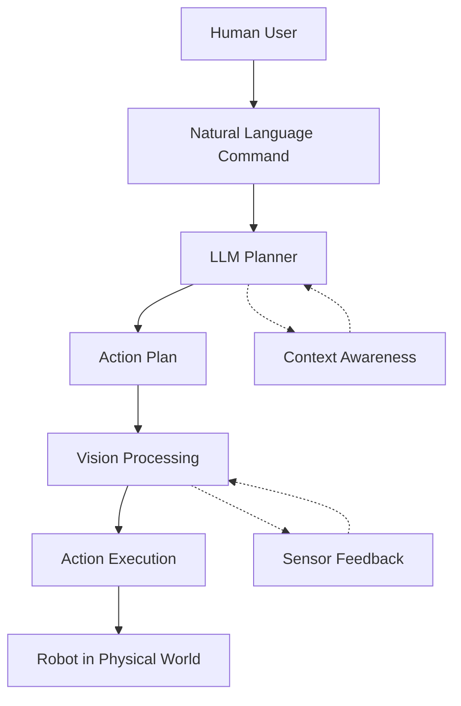
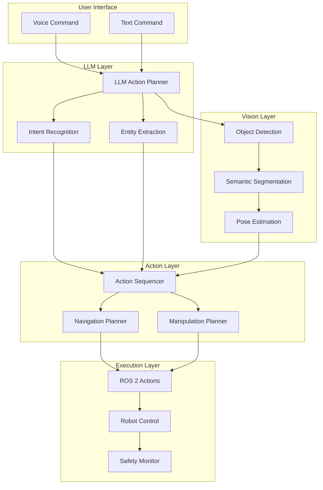
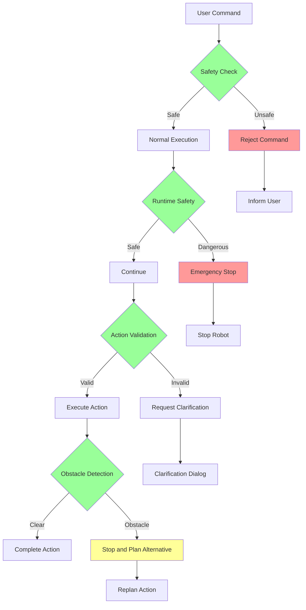

# Image Usage Examples for Physical AI & Humanoid Robotics Documentation

## Introduction

This document provides practical examples of how to incorporate images, diagrams, and visual elements into the Physical AI & Humanoid Robotics documentation. Each example shows the Markdown syntax and explains when and why to use specific visual elements.

## 1. Architecture Diagrams

### Example 1: ROS 2 Communication Architecture
**Location**: Module 1 - ROS 2 Fundamentals
**Purpose**: Illustrate the communication patterns in ROS 2

```markdown
## ROS 2 Communication Architecture

The Robot Operating System 2 (ROS 2) uses a distributed architecture where nodes communicate through topics, services, and actions. Understanding these communication patterns is crucial for developing effective robotic applications.


*Figure 1: ROS 2 communication architecture showing publisher-subscriber pattern and service calls.*

In this architecture:
- **Publishers** send messages to **topics**
- **Subscribers** receive messages from **topics**
- **Services** provide request-response communication
- **Actions** enable goal-feedback-result communication for long-running tasks
```

### Example 2: VLA System Architecture
**Location**: Module 4 - Vision-Language-Action Systems
**Purpose**: Show the complete flow from natural language to robot action

```markdown
## Complete VLA System Architecture

The Vision-Language-Action (VLA) system creates a complete pipeline from natural language commands to physical robot actions.



*Figure 2: Complete VLA system architecture showing the flow from human command to robot action.*

The system operates in the following phases:
1. **Language Understanding**: The LLM interprets the natural language command
2. **Action Planning**: The system creates a sequence of executable actions
3. **Vision Processing**: The system analyzes the environment to inform action execution
4. **Action Execution**: The robot carries out the planned actions
```

## 2. Process Flow Diagrams

### Example 3: Natural Language Processing Flow
**Location**: Module 4 - Vision-Language-Action Systems
**Purpose**: Explain how natural language commands are processed

```markdown
## Natural Language Processing Pipeline

When a user gives a command to the VLA system, it goes through several processing stages:


*Figure 3: Natural language processing pipeline from command to action plan.*

### Step-by-Step Process:

1. **Command Input**: The user provides a natural language command
   ```python
   command = "Go to the kitchen and find the red ball"
   ```

2. **Intent Recognition**: The LLM identifies the main tasks
   - Navigate to location: "kitchen"
   - Perform action: "find object"
   - Object specification: "red ball"

3. **Action Sequencing**: The system creates a logical sequence of actions
   - Navigate to kitchen
   - Detect objects in kitchen
   - Identify red ball among detected objects
   - Plan approach to red ball

4. **Execution Planning**: Convert high-level actions to ROS 2 goals
   - `NavigateToPose` action
   - `FindObject` service call
   - `GraspObject` action

### Code Example:
```python
class LLMActionPlanner:
    def plan_actions(self, command: str) -> Dict[str, Any]:
        """
        Convert natural language command to executable action plan
        """
        # LLM processing to extract intent and entities
        intent, entities = self.extract_intent_entities(command)

        # Create action sequence based on intent
        action_plan = self.create_action_sequence(intent, entities)

        # Validate plan feasibility
        validated_plan = self.validate_plan(action_plan)

        return validated_plan
```
```

## 3. Technical Comparison Charts

### Example 4: SDF vs URDF Comparison
**Location**: Module 2 - Digital Twin (Gazebo & Unity)
**Purpose**: Compare simulation description formats

```markdown
## SDF vs URDF Comparison

Simulation Description Format (SDF) and Unified Robot Description Format (URDF) are both XML-based formats used in robotics, but they serve different purposes.

| Aspect | SDF (Simulation Description Format) | URDF (Unified Robot Description Format) |
|--------|------------------------------------|----------------------------------------|
| **Primary Purpose** | Simulation environments | Robot modeling and kinematics |
| **Native Ecosystem** | Gazebo | ROS/ROS 2 |
| **World Definition** | ✅ Native support | ❌ Requires separate files |
| **Sensor Definition** | ✅ Native support | ⚠️ Requires Gazebo tags |
| **Plugin Support** | ✅ Native support | ⚠️ Requires Gazebo tags |
| **Joint Types** | All joint types | All joint types |
| **ROS Integration** | Through plugins | Native through robot_state_publisher |
| **File Extension** | `.sdf`, `.world` | `.urdf` |
| **Complexity** | Higher (more features) | Lower (focused on robot structure) |


*Figure 4: Visual comparison of SDF and URDF usage in robotics development.*

### When to Use Each:

**Use SDF when:**
- Creating complete simulation environments
- Defining complex physics properties
- Integrating custom Gazebo plugins
- Working primarily in Gazebo without ROS

**Use URDF when:**
- Working primarily in ROS/ROS 2 ecosystem
- Focusing on robot kinematics and structure
- Need compatibility with MoveIt! and other ROS tools
- Creating robot models for visualization in RViz
```

## 4. Hardware and Software Diagrams

### Example 5: Robot Hardware Architecture
**Location**: Module 1 - ROS 2 Fundamentals
**Purpose**: Show physical robot components and their ROS integration

```markdown
## Robot Hardware Architecture

A typical humanoid robot for VLA systems consists of multiple hardware components that integrate with ROS 2 for control and sensing.


*Figure 5: Hardware architecture of a humanoid robot with ROS 2 integration.*

### Key Components:

#### 1. Computing System
- **Main Computer**: Runs ROS 2 nodes and AI algorithms
- **Real-time Coprocessor**: Handles low-level motor control
- **GPU**: Accelerates vision and AI processing

#### 2. Mobility System
- **Base Platform**: Wheels, legs, or tracks for locomotion
- **Drive Motors**: Provide motion control
- **Encoders**: Provide odometry feedback

#### 3. Sensing System
- **Cameras**: RGB, stereo, or depth cameras for vision
- **LiDAR**: 2D or 3D laser scanning for mapping
- **IMU**: Inertial measurement for orientation
- **Force/Torque**: Sensors for manipulation feedback

#### 4. Manipulation System
- **Robotic Arms**: Multi-degree-of-freedom manipulators
- **End Effectors**: Grippers, suction cups, or specialized tools
- **Joint Motors**: Servos or stepper motors for precise control

### ROS 2 Integration:

Each hardware component connects to ROS 2 through device drivers that publish sensor data and subscribe to command topics:

```python
class HardwareInterface:
    def __init__(self):
        # Initialize hardware components
        self.camera_driver = CameraDriver()
        self.motor_controller = MotorController()
        self.lidar_driver = LidarDriver()

        # Create ROS 2 publishers and subscribers
        self.image_pub = self.create_publisher(Image, 'camera/image_raw', 10)
        self.cmd_vel_sub = self.create_subscription(Twist, 'cmd_vel', self.cmd_vel_callback, 10)
        self.joint_state_pub = self.create_publisher(JointState, 'joint_states', 10)

    def hardware_spin(self):
        """Main loop for hardware interface"""
        while rclpy.ok():
            # Read sensor data
            image_data = self.camera_driver.read()
            lidar_data = self.lidar_driver.read()

            # Publish sensor data
            self.publish_image(image_data)
            self.publish_lidar(lidar_data)

            time.sleep(0.01)  # 100 Hz
```
```

## 5. Code Architecture Diagrams

### Example 6: VLA System Code Architecture
**Location**: Module 4 - Vision-Language-Action Systems
**Purpose**: Show the software architecture of the VLA system

```markdown
## VLA System Software Architecture

The VLA system is built with a modular architecture that separates concerns while maintaining tight integration between components.



*Figure 6: Software architecture of the VLA system showing data flow between layers.*

### Component Responsibilities:

#### LLM Layer:
- **LLM Action Planner**: Converts natural language to action plans
- **Intent Recognition**: Identifies the user's goal
- **Entity Extraction**: Identifies relevant objects and locations

#### Vision Layer:
- **Object Detection**: Identifies objects in the environment
- **Semantic Segmentation**: Classifies pixels by object type
- **Pose Estimation**: Determines 3D position and orientation

#### Action Layer:
- **Action Sequencer**: Orders actions logically
- **Navigation Planner**: Plans paths to destinations
- **Manipulation Planner**: Plans grasping and manipulation

#### Execution Layer:
- **ROS 2 Actions**: Executes actions using standard interfaces
- **Robot Control**: Low-level motor control
- **Safety Monitor**: Ensures safe operation
```

## 6. Performance and Optimization Diagrams

### Example 7: System Performance Optimization
**Location**: Module 4 - Vision-Language-Action Systems
**Purpose**: Show performance considerations and optimizations

```markdown
## VLA System Performance Optimization

Achieving real-time performance in VLA systems requires careful optimization of each component in the pipeline.


*Figure 7: Performance optimization strategies for VLA systems.*

### Key Performance Factors:

#### 1. LLM Response Time
- Target: < 3 seconds for action planning
- Optimization: Use efficient models, caching, and parallel processing
- Fallback: Simplified planning when LLM is slow

#### 2. Vision Processing Speed
- Target: 10-30 FPS for real-time operation
- Optimization: Model quantization, hardware acceleration, ROI processing
- Fallback: Reduced resolution or frequency

#### 3. Action Execution Timing
- Target: Predictable execution within time bounds
- Optimization: Concurrent action execution where possible
- Fallback: Simplified actions or delays

### Performance Monitoring:

```python
class PerformanceMonitor:
    def __init__(self):
        self.metrics = {
            'llm_time': [],
            'vision_time': [],
            'action_time': [],
            'total_response_time': []
        }

    def measure_llm_performance(self, command: str) -> Dict[str, Any]:
        start_time = time.time()
        plan = self.llm_planner.plan_actions(command)
        llm_time = time.time() - start_time

        # Store metric
        self.metrics['llm_time'].append(llm_time)

        # Check if performance is acceptable
        avg_time = sum(self.metrics['llm_time'][-10:]) / len(self.metrics['llm_time'][-10:])
        if avg_time > 3.0:  # More than 3 seconds average
            self.trigger_performance_alert("LLM planning too slow")

        return plan

    def get_performance_report(self) -> Dict[str, float]:
        """Generate performance report"""
        report = {}
        for metric, values in self.metrics.items():
            if values:
                report[f"{metric}_avg"] = sum(values[-10:]) / len(values[-10:])
                report[f"{metric}_min"] = min(values)
                report[f"{metric}_max"] = max(values)

        return report
```

### Real-Time Constraints:

| Component | Target | Warning | Error |
|-----------|--------|---------|-------|
| LLM Planning | < 3 sec | 3-5 sec | > 5 sec |
| Vision Processing | < 100 ms/frame | 100-200 ms | > 200 ms |
| Action Execution | As specified | ±20% tolerance | ±50% tolerance |
| Total Response | < 5 sec | 5-10 sec | > 10 sec |
```

## 7. Safety and Error Handling Diagrams

### Example 8: Safety Architecture
**Location**: Module 4 - Vision-Language-Action Systems
**Purpose**: Illustrate safety systems and error handling

```markdown
## Safety Architecture for VLA Systems

Safety is paramount in VLA systems that operate in human environments. The architecture includes multiple layers of safety checks and fallback procedures.



*Figure 8: Safety architecture showing multiple layers of protection.*

### Safety Levels:

#### Level 1: Command Validation
- Static analysis of planned actions
- Kinematic feasibility checks
- Environmental constraint validation

#### Level 2: Runtime Monitoring
- Real-time obstacle detection
- Joint limit monitoring
- Force/torque limit checking

#### Level 3: Emergency Procedures
- Immediate stop capability
- Safe position recovery
- Operator notification

### Safety Implementation:

```python
class SafetyManager:
    def __init__(self):
        self.emergency_stop = False
        self.safety_limits = {
            'velocity': 1.0,  # m/s
            'acceleration': 2.0,  # m/s²
            'torque': 100.0,  # Nm
            'force': 50.0,  # N
        }

    def validate_action_plan(self, plan: Dict[str, Any]) -> Tuple[bool, List[str]]:
        """Validate action plan for safety"""
        errors = []

        for action in plan.get('actions', []):
            action_type = action.get('action_type')
            params = action.get('parameters', {})

            # Check velocity limits
            if action_type == 'move_to' and params.get('velocity', 0) > self.safety_limits['velocity']:
                errors.append(f"Action {action_type} exceeds velocity limit")

            # Check for dangerous movements
            if action_type == 'manipulate' and params.get('force', 0) > self.safety_limits['force']:
                errors.append(f"Action {action_type} exceeds force limit")

        return len(errors) == 0, errors

    def check_runtime_safety(self, robot_state: Dict[str, Any]) -> bool:
        """Check safety during action execution"""
        # Check joint limits
        joint_positions = robot_state.get('joint_positions', {})
        for joint, position in joint_positions.items():
            if abs(position) > self.get_joint_limit(joint):
                self.trigger_emergency_stop(f"Joint {joint} exceeded limits")
                return False

        # Check for obstacles
        distance_to_obstacle = robot_state.get('distance_to_obstacle', float('inf'))
        if distance_to_obstacle < 0.3:  # 30cm safety margin
            self.trigger_emergency_stop("Obstacle detected too close")
            return False

        return True

    def trigger_emergency_stop(self, reason: str):
        """Execute emergency stop procedure"""
        self.get_logger().error(f"EMERGENCY STOP: {reason}")
        self.emergency_stop = True

        # Send stop commands
        stop_cmd = Twist()
        self.cmd_vel_pub.publish(stop_cmd)

        # Move to safe position if possible
        self.move_to_safe_position()
```

## Best Practices for Image Integration

### 1. Alt Text and Descriptions
Always provide meaningful alt text and figure captions:

```markdown


*Figure X: Detailed system architecture showing the interaction between all major components.*
```

### 2. File Organization
Keep images organized in a clear directory structure:

```
docs/
├── images/
│   ├── logo.svg
│   ├── architecture/
│   │   ├── ros2-architecture.svg
│   │   └── vla-architecture.svg
│   ├── diagrams/
│   │   ├── sdf-urdf-comparison.svg
│   │   └── performance-optimization.svg
│   └── screenshots/
│       ├── simulation-environment.png
│       └── robot-control-interface.png
```

### 3. Responsive Images
Use appropriate sizing for different contexts:

```markdown
<!-- For documentation -->
{width=50%}

<!-- For detailed technical drawings -->
{width=100%}
```

### 4. Accessibility Considerations
- Provide text descriptions for complex diagrams
- Use high contrast colors
- Include labels and legends
- Consider colorblind accessibility

These examples demonstrate how to effectively integrate visual elements into your documentation to enhance understanding and engagement while maintaining professional quality and accessibility.